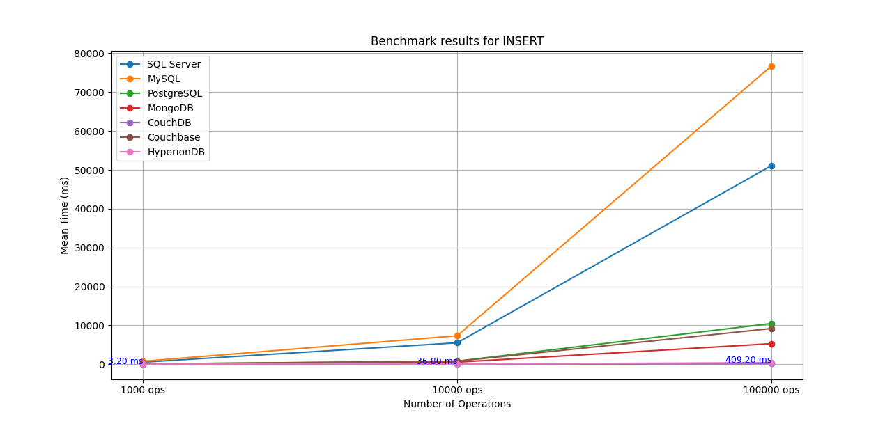
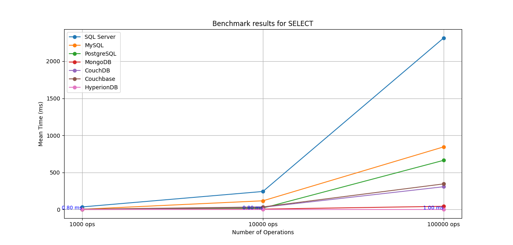
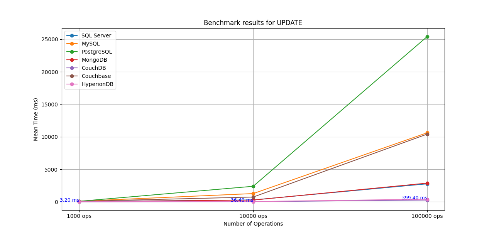
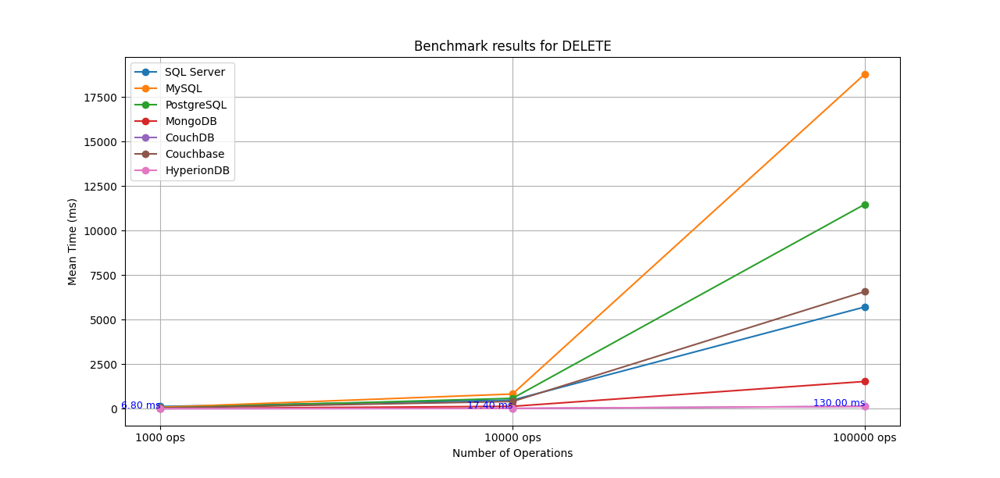

# HyperionDB
[](https://www.npmjs.com/package/hyperiondb)
[](https://github.com/yourusername/hyperiondb/blob/main/LICENSE)
[](https://www.npmjs.com/package/hyperiondb)


A minimalist Rust-based sharded database client for Node.js. HyperionDB offers high-performance data storage and retrieval with sharding support, making it suitable for scalable applications.

---
## 🚀 Features
- **High Performance**: Built with Rust for speed and efficiency.
- **Sharding Support**: Distribute data across multiple shards for scalability.
- **Easy Integration**: Simple API for Node.js applications.
- **Custom Indexing**: Define indexed fields for faster queries.
- **Cross-Platform**: Works on Windows, macOS, and Linux.
---

## 📊 Benchmark Results
The benchmarks for HyperionDB were conducted based on the performance testing methodology outlined in the article ["A Performance Comparison of SQL and NoSQL Databases"](https://arxiv.org/abs/1806.04761). Following similar operations and record counts (1000, 10,000, and 100,000), we evaluated HyperionDB's INSERT, QUERY, UPDATE, and DELETE performance. These results demonstrate HyperionDB's speed and performance, especially in query operations.

### Mean Performance Time (ms) for CRUD Operations

#### INSERT Operation
| Database              | 1000 records | 10,000 records | 100,000 records |
|-----------------------|--------------|----------------|-----------------|
| Microsoft SQL Server  | 530.1        | 5516.2        | 51075.7        |
| MySQL                 | 757.1        | 7326.4        | 76705.7        |
| PostgreSQL            | 80.9         | 798.7         | 10476.7        |
| MongoDB               | 54.9         | 533.8         | 5282.5         |
| CouchDB               | 1.39         | 19.7          | 141.95         |
| Couchbase             | 77.5         | 783.67        | 9188.13        |
| **HyperionDB**        | **3.20**     | **36.80**     | **409.20**     |



#### QUERY (SELECT) Operation
| Database              | 1000 records | 10,000 records | 100,000 records |
|-----------------------|--------------|----------------|-----------------|
| Microsoft SQL Server  | 35.3         | 243.6         | 2313.4         |
| MySQL                 | 4.1          | 117.8         | 844.8          |
| PostgreSQL            | 3.7          | 19.4          | 663.5          |
| MongoDB               | 1.0          | 6.0           | 43.5           |
| CouchDB               | 2.14         | 30.44         | 307.54         |
| Couchbase             | 4.34         | 34.89         | 345.77         |
| **HyperionDB**        | **0.80**     | **0.80**      | **1.00**       |



#### UPDATE Operation
| Database              | 1000 records | 10,000 records | 100,000 records |
|-----------------------|--------------|----------------|-----------------|
| Microsoft SQL Server  | 36.1         | 286.5         | 2764.8         |
| MySQL                 | 87.7         | 1264.0        | 10620.5        |
| PostgreSQL            | 77.3         | 2385.2        | 25421.5        |
| MongoDB               | 17.3         | 265.4         | 2875.9         |
| CouchDB               | 1.56         | 18.64         | 266.68         |
| Couchbase             | 73.16        | 731.39        | 10414.85       |
| **HyperionDB**        | **3.20**     | **36.40**     | **399.40**     |



#### DELETE Operation
| Database              | 1000 records | 10,000 records | 100,000 records |
|-----------------------|--------------|----------------|-----------------|
| Microsoft SQL Server  | 127.0        | 482.9         | 5715.4         |
| MySQL                 | 78.3         | 825.8         | 18794.4        |
| PostgreSQL            | 35.5         | 582.6         | 11479.8        |
| MongoDB               | 9.0          | 133.8         | 1530.9         |
| CouchDB               | 1.19         | 15.57         | 132.7          |
| Couchbase             | 39.37        | 405.57        | 6579.23        |
| **HyperionDB**        | **6.80**     | **17.40**     | **130.00**     |



The benchmark results show that HyperionDB provides competitive performance across all CRUD operations, particularly excelling in query operations. HyperionDB is well-suited for high-performance applications where rapid data access and updates are crucial.

## 📦 Installation
Install HyperionDB via npm:
```bash
npm install hyperiondb
```

## 🛠️ Setup and Usage

### **1. Import HyperionDBClient**

```javascript
const HyperionDBClient = require('hyperiondb/hyperiondb-client');
``` 

### **2. Configuration**

Create a configuration object specifying the number of shards, data directory, indexed fields, server address, and primary key field.

```javascript
const config = {
  numShards: 8,
  dataDir: './hyperiondb_data',
  indexedFields: [
    ["name", "String"],
    ["price", "Numeric"],
    ["city", "String"],
    // Add other indexed fields as needed
  ],
  address: '127.0.0.1:8080'
};
const primaryKey = 'id';` 
```
### **3. Initialize the Client**

Instantiate the HyperionDBClient with the configuration and primary key.

```javascript
const client = new HyperionDBClient(config, primaryKey);` 
```
### **4. Initialize the Database and Start the Server**


```javascript
(async () => {
  try {
    // Initialize the database
    await client.initialize();
    console.log('Database initialized.');

    // Start the server
    await client.startServer();
    console.log('Server started.');
  } catch (error) {
    console.error('Initialization error:', error);
  }
})();
```
----------

## 🔄 CRUD Operations


### **Write a Record (Insert or Update)**

The `writeRecord` method allows you to insert or update records based on the specified primary key. If a record with the same key exists, it merges the new data with the existing one; otherwise, it creates a new entry.


```javascript
const record = {
  id: 'prod1748',
  name: 'Sample Product',
  price: 355.00,
  // other fields...
};

(async () => {
  const response = await client.writeRecord(record);
  console.log('Write response:', response); // Output: 'OK'
})();
```
### **Retrieve a Record**

```javascript
(async () => {
  const record = await client.get('prod1748');
  console.log('Retrieved record:', record);
})();
```


### **Delete a Record**

```javascript
(async () => {
  const success = await client.delete('id = "prod1748"');
  console.log('Delete successful:', success); // Output: true
})();
``` 

----------

## 🔍 Querying the Database

```javascript
(async () => {
  const results = await client.query('price > 300 AND city = "New York"');
  console.log('Query results:', results);
})();
``` 

----------

## 📄 API Reference

### **Constructor**

#### `new HyperionDBClient(config, primaryKey)`

-   **config**: An object containing configuration settings.
    -   **numShards**: Number of shards.
    -   **dataDir**: Directory where shards are stored.
    -   **indexedFields**: Array of indexed fields, each as `[fieldName, indexType]`.
    -   **address**: Address and port of the HyperionDB server (e.g., `'127.0.0.1:8080'`).
-   **primaryKey**: The primary key field for records (e.g., `'id'`).

### **Methods**

#### `initialize()`

Initializes the database with the provided configuration.

#### `startServer()`

Starts the HyperionDB server on the specified address and port.


#### `writeRecord(record)`

Inserts or updates a record in the database. If the record exists (based on the primary key), updates the record by merging the new fields. If it doesn't exist, inserts the new record.

-   **record**: The record object to insert or update.

#### `get(id)`

Retrieves a record by its ID.

-   **id**: The ID of the record to retrieve.

#### `delete(condition)`

Deletes records matching the specified condition.

-   **condition**: A string representing the deletion condition (e.g., `'price < 100'`).

#### `list()`

Lists all records in the database.

#### `query(queryStr)`

Queries the database with complex conditions.

-   **queryStr**: The query string (e.g., `'name CONTAINS "John" AND age > 30'`).
----------

## 📝 Examples

### **Example: Insert and Query**

```javascript
(async () => {
  // Insert multiple records
  await client.writeRecord({ id: '1', name: 'Alice', age: 30 });
  await client.writeRecord({ id: '2', name: 'Bob', age: 25 });
  await client.writeRecord({ id: '3', name: 'Charlie', age: 35 });

  // Query records where age is greater than 28
  const results = await client.query('age > 28');
  console.log('Query results:', results);
  // Output: [{ id: '1', name: 'Alice', age: 30 }, { id: '3', name: 'Charlie', age: 35 }]
})();
```
----------

## ⚙️ Configuration Options

-   **Sharding**: Adjust `numShards` based on your performance and scaling needs.
-   **Indexed Fields**: Index fields that are frequently used in queries to improve performance.
-   **Data Directory**: Ensure the `dataDir` has sufficient permissions and storage space.

----------

## 📌 Notes

-   **Server Readiness**: After starting the server, ensure it's ready before performing operations.
-   **Error Handling**: Wrap your operations in `try...catch` blocks to handle exceptions.
-   **Data Types**: Ensure data types of fields match those specified in `indexedFields`.

----------

## 🛠️ Development

### **Building from Source**

Clone the repository:

```bash
git clone https://github.com/yourusername/hyperiondb.git
```
Install dependencies:


```bash
cd hyperiondb
npm install
```

Build the module:

```bash
npm run build
```

----------

## 🖥️ Compatibility

-   **Node.js**: Requires Node.js version >= 10.
-   **Platforms**: Windows, macOS, Linux (including ARM architectures).

----------

## 📄 License

This project is licensed under the MIT License - see the [LICENSE](https://github.com/yourusername/hyperiondb/blob/main/LICENSE) file for details.

----------

## 🙏 Acknowledgements

-   Built with ❤️ using Rust and Node.js.
-   Thanks to the open-source community for their contributions.

----------

## 📫 Contact

For questions or support, please open an issue on [GitHub](https://github.com/yourusername/hyperiondb/issues) or contact me at hi@pailletjp.com

----------

## 🌟 Contributions

Contributions are welcome! Please read the [contributing guidelines](https://github.com/yourusername/hyperiondb/blob/main/CONTRIBUTING.md) before submitting a pull request.

----------

## 🛡️ Security

If you discover any security-related issues, please email your.email@example.com instead of using the issue tracker.

----------

## 🗺️ Roadmap

-   Implement authentication and authorization.
-   Add support for more data types.
-   Improve documentation and examples.
-   Integrate with popular frameworks.

----------

## 💡 Tips

-   **Performance**: For better performance, adjust the number of shards based on your system's capabilities.
-   **Data Backup**: Regularly backup your `dataDir` to prevent data loss.
-   **Logging**: Implement logging mechanisms for debugging and monitoring.

----------

## ❓ FAQ

**Q:** _Can I use HyperionDB in a production environment?_

**A:** While HyperionDB is designed for high performance, please thoroughly test it in your environment before deploying to production.

**Q:** _Does HyperionDB support transactions?_

**A:** Currently, HyperionDB does not support transactions, but this feature is planned for future releases.

----------

_Happy coding!_